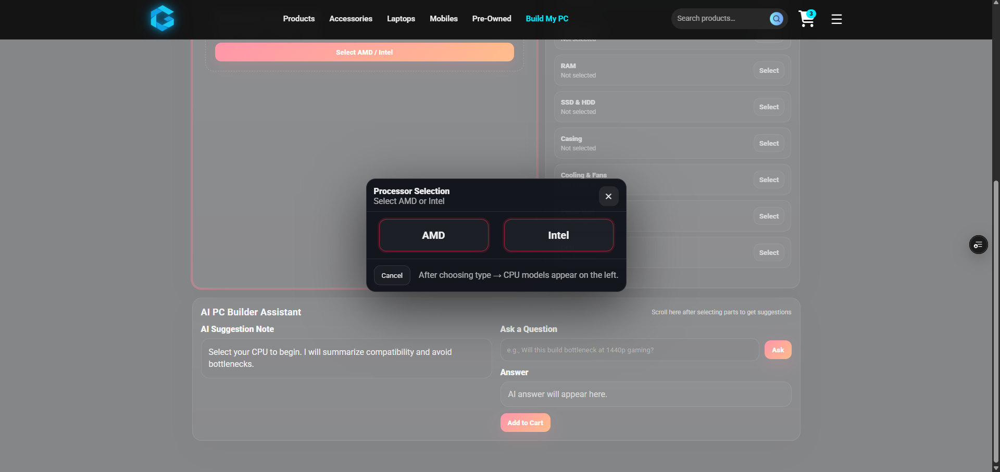
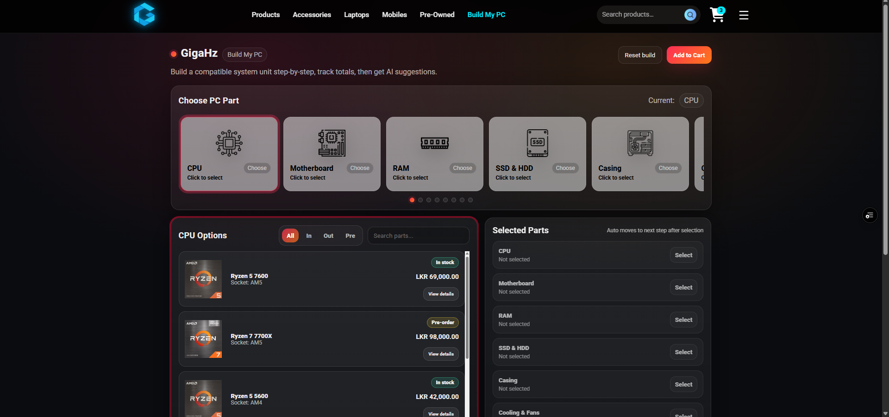
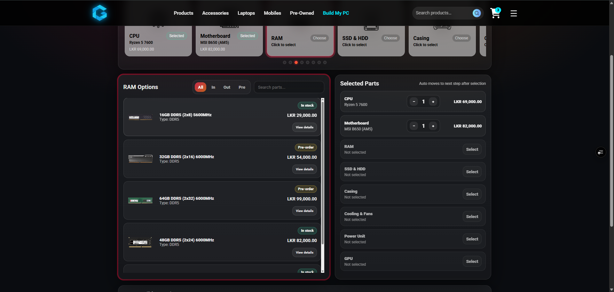
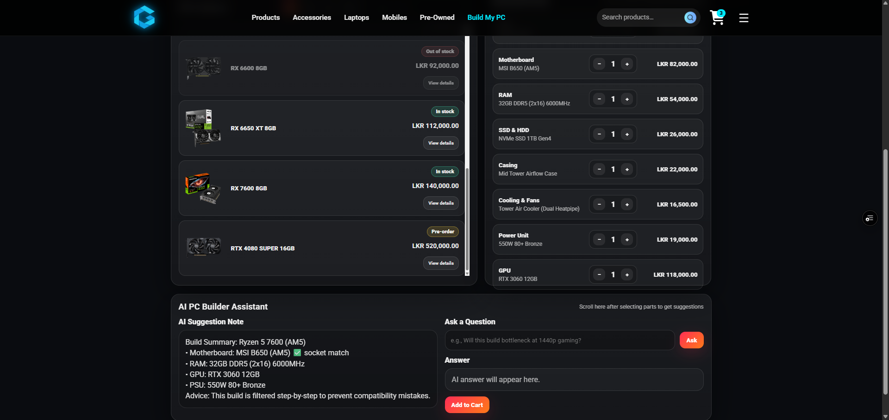
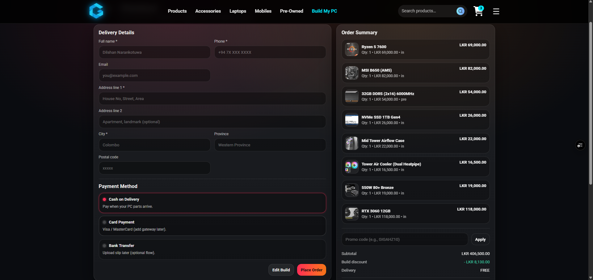

# ⚡ GigaHz - Smart PC Building Platform

<div align="center">

[](https://reactjs.org/)
[](https://nodejs.org/)
[](https://expressjs.com/)
[](https://www.postgresql.org/)
[](https://giga-hz.vercel.app)

**A full-stack intelligent PC building platform with real-time hardware compatibility validation**

[🌐 Live Demo](https://gigahz-demo.vercel.app) • [📖 Documentation](#-documentation) • [🐛 Report Bug](https://github.com/DilshanNarankotuwa/GigaHz/issues) • [✨ Request Feature](https://github.com/DilshanNarankotuwa/GigaHz/issues)


</div>

---

## 📑 Table of Contents

- [Overview](#-overview)
- [Key Features](#-key-features)
- [Screenshots](#-screenshots)
- [Architecture](#️-architecture)
- [Tech Stack](#-tech-stack)
- [Getting Started](#-getting-started)
- [Project Structure](#-project-structure)
- [API Documentation](#-api-documentation)
- [Database Schema](#️-database-schema)
- [Deployment](#-deployment)
- [Roadmap](#-roadmap)
- [Contributing](#-contributing)
- [License](#-license)
- [Contact](#-contact)

---

## 🎯 Overview

**GigaHz** is an intelligent PC building and e-commerce platform that prevents invalid hardware configurations through real-time compatibility validation. Unlike traditional PC part retailers, GigaHz enforces hardware constraints and validates component compatibility as users build their systems.

### The Problem
Building a PC requires understanding complex hardware compatibility rules. Users often purchase incompatible components, leading to frustration and returns.

### The Solution
GigaHz implements a constraint-based validation system that ensures:
- CPU and motherboard socket compatibility
- RAM type matching with motherboard specifications
- Adequate PSU wattage for system requirements
- Proper form factor alignment
- Expandable validation rules for future constraints

### Why GigaHz?
- **🛡️ Prevents costly mistakes** - Real-time validation before purchase
- **🎓 Educational** - Learn about PC building through guided process
- **⚡ Fast & Intuitive** - Streamlined build flow with smart suggestions
- **🔧 Comprehensive** - Full-stack solution with modern architecture

---

## ✨ Key Features

### 🖥️ Intelligent PC Builder
- **Step-by-step guided build process** with visual component selection
- **Real-time compatibility checking** across all hardware components
- **Smart filtering** - Only shows compatible parts based on selections
- **Power budget calculator** - Ensures PSU can handle total system load
- **AI-powered suggestions** for optimal component combinations
- **Build templates** for different use cases (Gaming, Workstation, Budget)

### 🛒 E-Commerce Functionality
- **Product catalog** with detailed specifications
- **Category-based browsing** (CPU, GPU, RAM, Motherboard, Storage, PSU, Case)
- **Advanced search and filters** by price, brand, performance
- **Shopping cart integration** with saved builds
- **Price tracking** and availability notifications

### 🔐 User Management
- **User authentication** and profile management
- **Save and share builds** with the community
- **Build history** tracking
- **Wishlist functionality**

### 🎨 Modern UI/UX
- **Responsive design** optimized for all devices
- **Dark/Light mode** support
- **Interactive 3D component previews** (planned)
- **Smooth animations** and transitions
- **Accessibility-first** approach

### 🔧 Technical Features
- **RESTful API architecture**
- **Database-driven constraint validation**
- **Modular monorepo structure**
- **Scalable backend design**
- **Optimized database queries**
- **Error handling and logging**

---

## 📸 Screenshots


### Homepage


### Build Your PC - Step 1: CPU Selection


### Build Your PC - Step 2: Compatible Parts


### Build Your PC - Step 3: Build Overview


### Build Your PC - Step 4: AI Suggestions


### Checkout Process


---

## 🏗️ Architecture

```
┌─────────────────┐         ┌─────────────────┐      ┌─────────────────┐
│                 │         │                 │      │                 │
│  React Frontend │ ─────▶ │  Express API    │─────▶│  PostgreSQL DB  │
│  (Port 5173)    │         │  (Port 3000)    │      │  (Port 5432)    │
│                 │         │                 │      │                 │
└─────────────────┘         └─────────────────┘      └─────────────────┘
         │                        │                        │
         │                        │                        │
    UI/UX Layer            Business Logic          Data Persistence
    - Component State      - Validation Rules      - Component Specs
    - User Interactions    - API Routes            - Compatibility Rules
    - Build Flow           - Auth Middleware       - User Data
```

### System Flow
1. **User selects component** → Frontend sends request to API
2. **API validates compatibility** → Queries database for constraints
3. **Database returns compatible parts** → Filtered by socket, type, etc.
4. **API returns filtered options** → Frontend displays valid choices
5. **User completes build** → Total validated, cart updated

---

## 🛠️ Tech Stack

### Frontend (gigahz-frontend)
| Technology | Purpose | Version |
|-----------|---------|---------|
| **React** | UI Framework | 18.x |
| **React Router** | Client-side routing | 6.x |
| **Axios** | HTTP client | 1.x |
| **CSS3 / TailwindCSS** | Styling | - |
| **Vite** | Build tool & dev server | 5.x |
| **React Icons** | Icon library | - |

### Backend (gigahz-backend)
| Technology | Purpose | Version |
|-----------|---------|---------|
| **Node.js** | Runtime environment | 18.x+ |
| **Express.js** | Web framework | 4.x |
| **PostgreSQL** | Relational database | 15.x |
| **Prisma** | ORM (if used) | 5.x |
| **JWT** | Authentication | - |
| **bcrypt** | Password hashing | - |
| **dotenv** | Environment config | - |
| **cors** | Cross-origin requests | - |

### DevOps & Deployment
| Tool | Purpose |
|------|---------|
| **Vercel** | Frontend hosting |
| **Railway/Render** | Backend hosting |
| **Supabase/Neon** | Database hosting |
| **Git/GitHub** | Version control |
| **GitHub Actions** | CI/CD (planned) |

---

## 🚀 Getting Started

### Prerequisites

Before you begin, ensure you have the following installed:
- **Node.js** (v18.0 or higher) - [Download](https://nodejs.org/)
- **npm** or **yarn** package manager
- **PostgreSQL** (v15.0 or higher) - [Download](https://www.postgresql.org/download/)
- **Git** - [Download](https://git-scm.com/downloads)

### Installation

#### 1️⃣ Clone the Repository
```bash
git clone https://github.com/DilshanNarankotuwa/GigaHz.git
cd GigaHz
```

#### 2️⃣ Backend Setup

```bash
# Navigate to backend directory
cd gigahz-backend

# Install dependencies
npm install

# Create .env file
touch .env
```

**Configure `.env` file:**
```env
# Database Configuration
PGHOST=localhost
PGPORT=5432
PGUSER=postgres
PGPASSWORD=your_password_here
PGDATABASE=gigahz

# Server Configuration
PORT=3000
NODE_ENV=development

# JWT Secret
JWT_SECRET=your_jwt_secret_here

# API Configuration
API_URL=http://localhost:3000
```

**Initialize Database:**
```bash
# Create database
createdb gigahz

# Run migrations (if using Prisma)
npx prisma migrate dev

# Seed database with sample data (optional)
npm run seed
```

**Start Backend Server:**
```bash
npm run dev
```

Backend should now be running at `http://localhost:3000`

#### 3️⃣ Frontend Setup

Open a new terminal window:

```bash
# Navigate to frontend directory
cd gigahz-frontend

# Install dependencies
npm install

# Create .env file
touch .env
```

**Configure `.env` file:**
```env
VITE_API_URL=http://localhost:3000
VITE_APP_NAME=GigaHz
```

**Start Frontend Development Server:**
```bash
npm run dev
```

Frontend should now be running at `http://localhost:5173`

#### 4️⃣ Access the Application

Open your browser and navigate to:
```
http://localhost:5173
```

---

## 📁 Project Structure

```
GigaHz/
│
├── gigahz-frontend/              # React frontend application
│   ├── public/                   # Static assets
│   ├── src/
│   │   ├── components/           # React components
│   │   │   ├── BuildFlow/        # PC building wizard components
│   │   │   ├── ProductCard/      # Product display components
│   │   │   ├── Cart/             # Shopping cart components
│   │   │   └── common/           # Reusable UI components
│   │   ├── pages/                # Page-level components
│   │   │   ├── Home.jsx
│   │   │   ├── BuildPC.jsx
│   │   │   ├── Products.jsx
│   │   │   ├── Checkout.jsx
│   │   │   └── Profile.jsx
│   │   ├── services/             # API service layer
│   │   │   ├── api.js            # Axios configuration
│   │   │   ├── products.js       # Product API calls
│   │   │   └── builds.js         # Build API calls
│   │   ├── context/              # React Context providers
│   │   ├── hooks/                # Custom React hooks
│   │   ├── utils/                # Utility functions
│   │   ├── styles/               # Global styles
│   │   ├── App.jsx               # Main App component
│   │   └── main.jsx              # Entry point
│   ├── .env                      # Environment variables
│   ├── package.json              # Dependencies
│   └── vite.config.js            # Vite configuration
│
├── gigahz-backend/               # Express backend API
│   ├── src/
│   │   ├── config/               # Configuration files
│   │   │   ├── database.js       # Database connection
│   │   │   └── constants.js      # App constants
│   │   ├── controllers/          # Route controllers
│   │   │   ├── productController.js
│   │   │   ├── buildController.js
│   │   │   ├── userController.js
│   │   │   └── authController.js
│   │   ├── models/               # Database models
│   │   │   ├── Product.js
│   │   │   ├── Build.js
│   │   │   └── User.js
│   │   ├── routes/               # API routes
│   │   │   ├── products.js
│   │   │   ├── builds.js
│   │   │   ├── users.js
│   │   │   └── auth.js
│   │   ├── middleware/           # Express middleware
│   │   │   ├── auth.js           # Authentication
│   │   │   ├── validation.js     # Input validation
│   │   │   └── errorHandler.js   # Error handling
│   │   ├── services/             # Business logic
│   │   │   ├── compatibilityService.js
│   │   │   ├── psuCalculator.js
│   │   │   └── buildValidator.js
│   │   ├── utils/                # Utility functions
│   │   └── app.js                # Express app setup
│   ├── prisma/                   # Prisma ORM (if used)
│   │   └── schema.prisma
│   ├── .env                      # Environment variables
│   ├── package.json              # Dependencies
│   └── server.js                 # Server entry point
│
├── screenshots/                  # Application screenshots
│   ├── home.png
│   ├── build0.png
│   ├── build1.png
│   ├── build2.png
│   ├── build3.png
│   └── build4.png
│
└── README.md                     # This file
```

---

## 📡 API Documentation

### Base URL
```
Development: http://localhost:3000/api
Production: https://your-api-domain.com/api
```

### Authentication
Most endpoints require JWT authentication. Include token in headers:
```
Authorization: Bearer <your_jwt_token>
```

### Core Endpoints

#### Products

| Method | Endpoint | Description | Auth Required |
|--------|----------|-------------|---------------|
| GET | `/products` | Get all products | No |
| GET | `/products/:id` | Get product by ID | No |
| GET | `/products/category/:category` | Get products by category | No |
| GET | `/products/compatible` | Get compatible products | Yes |
| POST | `/products` | Create product (Admin) | Yes |
| PUT | `/products/:id` | Update product (Admin) | Yes |
| DELETE | `/products/:id` | Delete product (Admin) | Yes |

#### Builds

| Method | Endpoint | Description | Auth Required |
|--------|----------|-------------|---------------|
| GET | `/builds` | Get user's builds | Yes |
| GET | `/builds/:id` | Get build by ID | Yes |
| POST | `/builds` | Create new build | Yes |
| PUT | `/builds/:id` | Update build | Yes |
| DELETE | `/builds/:id` | Delete build | Yes |
| POST | `/builds/validate` | Validate build compatibility | Yes |

#### Authentication

| Method | Endpoint | Description | Auth Required |
|--------|----------|-------------|---------------|
| POST | `/auth/register` | Register new user | No |
| POST | `/auth/login` | User login | No |
| POST | `/auth/logout` | User logout | Yes |
| GET | `/auth/me` | Get current user | Yes |

#### Categories

| Method | Endpoint | Description | Auth Required |
|--------|----------|-------------|---------------|
| GET | `/categories` | Get all categories | No |
| GET | `/categories/:id/products` | Get products in category | No |

### Example Requests

**Get Compatible Motherboards:**
```bash
curl -X GET "http://localhost:3000/api/products/compatible" \
  -H "Authorization: Bearer YOUR_TOKEN" \
  -H "Content-Type: application/json" \
  -d '{
    "cpu_id": 1,
    "socket_type": "AM5"
  }'
```

**Create Build:**
```bash
curl -X POST "http://localhost:3000/api/builds" \
  -H "Authorization: Bearer YOUR_TOKEN" \
  -H "Content-Type: application/json" \
  -d '{
    "name": "Gaming Rig 2024",
    "components": {
      "cpu_id": 1,
      "motherboard_id": 5,
      "ram_id": 12,
      "gpu_id": 8,
      "storage_id": 15,
      "psu_id": 20,
      "case_id": 25
    }
  }'
```

---

## 🗄️ Database Schema

### Core Tables

**products**
```sql
id              SERIAL PRIMARY KEY
name            VARCHAR(255) NOT NULL
category        VARCHAR(50) NOT NULL
price           DECIMAL(10,2) NOT NULL
brand           VARCHAR(100)
stock           INTEGER DEFAULT 0
image_url       TEXT
specs           JSONB
created_at      TIMESTAMP DEFAULT NOW()
updated_at      TIMESTAMP DEFAULT NOW()
```

**builds**
```sql
id              SERIAL PRIMARY KEY
user_id         INTEGER REFERENCES users(id)
name            VARCHAR(255)
cpu_id          INTEGER REFERENCES products(id)
motherboard_id  INTEGER REFERENCES products(id)
ram_id          INTEGER REFERENCES products(id)
gpu_id          INTEGER REFERENCES products(id)
storage_id      INTEGER REFERENCES products(id)
psu_id          INTEGER REFERENCES products(id)
case_id         INTEGER REFERENCES products(id)
total_price     DECIMAL(10,2)
total_power     INTEGER
is_valid        BOOLEAN DEFAULT true
created_at      TIMESTAMP DEFAULT NOW()
updated_at      TIMESTAMP DEFAULT NOW()
```

**users**
```sql
id              SERIAL PRIMARY KEY
username        VARCHAR(100) UNIQUE NOT NULL
email           VARCHAR(255) UNIQUE NOT NULL
password_hash   VARCHAR(255) NOT NULL
role            VARCHAR(20) DEFAULT 'user'
created_at      TIMESTAMP DEFAULT NOW()
```

**compatibility_rules**
```sql
id              SERIAL PRIMARY KEY
rule_type       VARCHAR(50) NOT NULL
component_type  VARCHAR(50) NOT NULL
constraint_data JSONB NOT NULL
description     TEXT
active          BOOLEAN DEFAULT true
```

### Relationships
- Users have many Builds
- Builds reference multiple Products (components)
- Products follow Compatibility Rules

---

## 🌐 Deployment

### Frontend Deployment (Vercel)

1. **Connect GitHub Repository:**
   - Go to [Vercel Dashboard](https://vercel.com)
   - Import `gigahz-frontend` folder
   - Configure build settings

2. **Build Settings:**
   ```
   Framework Preset: Vite
   Build Command: npm run build
   Output Directory: dist
   Install Command: npm install
   ```

3. **Environment Variables:**
   Add in Vercel dashboard:
   ```
   VITE_API_URL=https://your-backend-url.com
   ```

4. **Deploy:**
   - Push to main branch
   - Vercel auto-deploys

### Backend Deployment (Railway)

1. **Create New Project:**
   - Go to [Railway](https://railway.app)
   - Create new project
   - Select GitHub repo

2. **Add PostgreSQL:**
   - Add PostgreSQL database service
   - Copy connection string

3. **Configure Environment:**
   ```
   PORT=3000
   DATABASE_URL=postgresql://...
   JWT_SECRET=your_secret
   NODE_ENV=production
   ```

4. **Deploy:**
   - Railway auto-builds and deploys

### Alternative: Docker Deployment

**Dockerfile (Backend):**
```dockerfile
FROM node:18-alpine
WORKDIR /app
COPY package*.json ./
RUN npm install --production
COPY . .
EXPOSE 3000
CMD ["npm", "start"]
```

**docker-compose.yml:**
```yaml
version: '3.8'
services:
  backend:
    build: ./gigahz-backend
    ports:
      - "3000:3000"
    environment:
      - DATABASE_URL=postgresql://db:5432/gigahz
    depends_on:
      - db
  
  db:
    image: postgres:15
    environment:
      POSTGRES_DB: gigahz
      POSTGRES_PASSWORD: password
    volumes:
      - postgres_data:/var/lib/postgresql/data

volumes:
  postgres_data:
```

---

## 🗺️ Roadmap

### Phase 1: Core Features ✅
- [x] Basic product catalog
- [x] PC build flow
- [x] Compatibility validation
- [x] User authentication
- [x] Shopping cart

### Phase 2: Enhanced Features 🚧
- [ ] AI-powered build recommendations
- [ ] Price tracking and alerts
- [ ] Build sharing and community
- [ ] Performance benchmarking
- [ ] 3D component visualization

### Phase 3: Advanced Features 📋
- [ ] Real-time inventory sync
- [ ] Multi-vendor marketplace
- [ ] Affiliate program
- [ ] Mobile app (React Native)
- [ ] Admin dashboard
- [ ] Analytics and reporting

### Phase 4: Optimization 🔮
- [ ] GraphQL API
- [ ] Server-side rendering (Next.js)
- [ ] Progressive Web App (PWA)
- [ ] Advanced caching
- [ ] Load balancing
- [ ] Microservices architecture

---

## 🤝 Contributing

Contributions make the open-source community an amazing place to learn, inspire, and create. Any contributions you make are **greatly appreciated**.

### How to Contribute

1. **Fork the Project**
   ```bash
   git clone https://github.com/DilshanNarankotuwa/GigaHz.git
   ```

2. **Create Feature Branch**
   ```bash
   git checkout -b feature/AmazingFeature
   ```

3. **Commit Changes**
   ```bash
   git commit -m 'Add some AmazingFeature'
   ```

4. **Push to Branch**
   ```bash
   git push origin feature/AmazingFeature
   ```

5. **Open Pull Request**

### Development Guidelines

- Follow existing code style
- Write meaningful commit messages
- Add tests for new features
- Update documentation
- Keep PRs focused and small

### Code of Conduct

This project follows the [Contributor Covenant Code of Conduct](https://www.contributor-covenant.org/version/2/0/code_of_conduct/).

---

## 📄 License

This project is licensed under the MIT License - see the [LICENSE](LICENSE) file for details.

```
MIT License

Copyright (c) 2024 Dilshan Narankotuwa

Permission is hereby granted, free of charge, to any person obtaining a copy
of this software and associated documentation files (the "Software"), to deal
in the Software without restriction, including without limitation the rights
to use, copy, modify, merge, publish, distribute, sublicense, and/or sell
copies of the Software, and to permit persons to whom the Software is
furnished to do so, subject to the following conditions:

The above copyright notice and this permission notice shall be included in all
copies or substantial portions of the Software.
```

---

## 📞 Contact

**Dilshan Narankotuwa**
- 🌐 Website: [personal portfolio](https://giga-hz.vercel.app)
- 📧 Email: [mail me](narankotuwadilshan@gmail.com)
- 💼 LinkedIn: [LinkedIn](https://www.linkedin.com/in/dilshan-narankotuwa)
- 🐱 GitHub: [@DilshanNarankotuwa](https://github.com/DilshanNarankotuwa)

**Project Link:** [https://github.com/DilshanNarankotuwa/GigaHz](https://github.com/DilshanNarankotuwa/GigaHz)

---

## 🙏 Acknowledgments

- [React](https://reactjs.org/) - Frontend framework
- [Node.js](https://nodejs.org/) - Backend runtime
- [PostgreSQL](https://www.postgresql.org/) - Database
- [Vercel](https://vercel.com) - Hosting platform
- [Font Awesome](https://fontawesome.com) - Icons
- [Unsplash](https://unsplash.com) - Stock images

---

## 📊 Project Stats


---

<div align="center">

### ⭐ Star this repository if you find it helpful!

**Made with ❤️ by Dilshan Narankotuwa**

[⬆ Back to Top](#-gigahz---smart-pc-building-platform)

</div>
